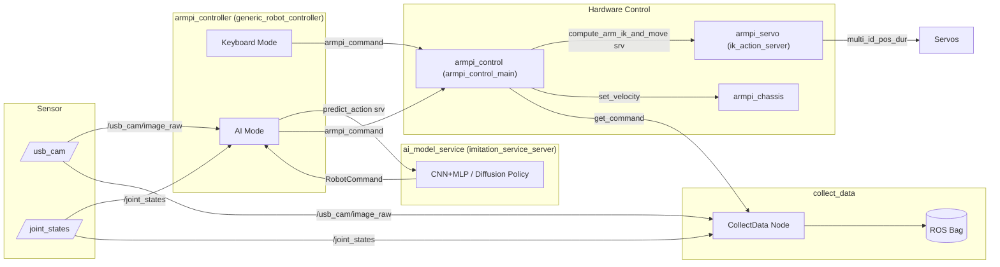
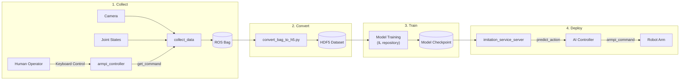

[English](README.md) | [日本語](README_ja.md)

# ArmPi - Imitation Learning for Robot Arm Control

An imitation learning system for the HiWonder ArmPi robot arm that collects human demonstrations, trains CNN+MLP policies, and deploys them for autonomous control.

## Project Overview

This project enables a robot arm to learn manipulation tasks from human demonstrations:

1. **Collect** - A human operator controls the robot arm via keyboard while camera observations and joint states are recorded
2. **Convert** - Raw ROS bag recordings are converted to HDF5 datasets for training
3. **Train** - CNN+MLP or Diffusion Policy models are trained on the demonstration data
4. **Deploy** - Trained models run as a ROS service, providing real-time action inference for autonomous control

## Tech Stack

| Category | Technologies |
|----------|-------------|
| Robotics | ROS 1 (Noetic), Inverse Kinematics |
| Languages | C++17 (control), Python 3.10 (ML/inference) |
| ML | PyTorch 2.1, TorchVision, Diffusion Policy |
| Data | HDF5, Pandas, OpenCV |
| Infrastructure | Docker (GPU), Conda, SDL2 |

## Repository Structure

```
ros/
  armpi/                  # Low-level robot control
    armpi_servo/          #   Servo drivers & IK action server
    armpi_control/        #   Main control node
    armpi_chassis/        #   Chassis (mobile base) control
  myapp/
    armpi_controller/     #   Controller abstraction (keyboard / AI mode)
    collect_data/         #   Data collection from human demonstrations
    ai_model_service/     #   ML inference ROS service
  share/
    armpi_operation_msgs/ #   Custom ROS message definitions
scripts/
  convert/                # ROS bag to HDF5 conversion
  create_video.py         # Generate videos from collected data
  docker_run.sh           # Launch Docker development container
datasets/                 # Collected demonstration data (not tracked)
models/                   # Trained model checkpoints (not tracked)
```

## Setup

### Prerequisites

- NVIDIA GPU with CUDA support
- Docker with NVIDIA Container Toolkit
- HiWonder ArmPi robot on the same network (default: `192.168.149.1`)

### Docker Environment

The Docker container provides ROS Noetic, PyTorch, and all dependencies pre-installed.

```bash
# Build the Docker image
docker build -t armpi_env .

# Launch the container (mounts ros/myapp, ros/share, datasets, models)
./scripts/docker_run.sh
```

The container runs with `--gpus all` and `--net=host` for GPU access and ROS networking.

### Inside the Container

```bash
# Build the ROS workspace
cd ~/ros_ws
catkin_make
source devel/setup.bash
```

### Conda Environment (for data conversion on host)

```bash
conda env create -f environment.yml
conda activate armpi_env
```

## Usage

### 1. Start Robot Control Nodes (on Raspberry Pi)

```bash
roslaunch armpi start_armpi_control.launch
```

### 2. Collect Demonstration Data

Launch the controller in keyboard mode and record ROS bags of human demonstrations.

### 3. Convert Data

Convert recorded ROS bags to HDF5 format for training:

```bash
conda activate armpi_env
python scripts/convert/main.py
```

### 4. Train a Model

Training is handled in the separate IL (Imitation Learning) repository. See [Related Repositories](#related-repositories).

### 5. Deploy for Autonomous Control

```bash
# Inside Docker container
roslaunch myapp run_ai_controller.launch model_name:=<your_model>
```

This launches the inference server and controller in AI mode.

## Demo

### Autonomous Control (Inference)

<video src="https://github.com/shutouyusei/ArmPi/releases/download/demo-videos/armpi_inference.mp4" controls></video>

### Teleoperation (Data Collection)

<video src="https://github.com/shutouyusei/ArmPi/releases/download/demo-videos/armpi_teleop.mp4" controls></video>

## Architecture

### ROS Node Communication



### Data Pipeline



## Related Repositories

- [**IL (Imitation Learning)**](https://github.com/shutouyusei/IL) - Model training code, network architectures, and training pipelines. See this repository for details on CNN+MLP and Diffusion Policy implementations.

## License

This project is licensed under the MIT License. See the [LICENSE](LICENSE) file for details.
