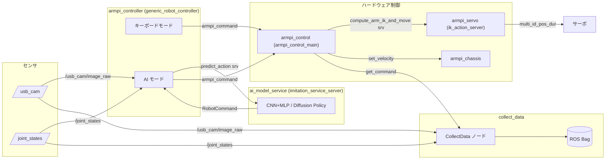
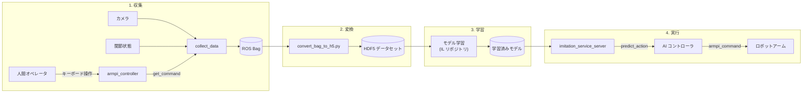

[English](README.md) | [日本語](README_ja.md)

# ArmPi - ロボットアームの模倣学習

HiWonder ArmPi ロボットアームを対象とした模倣学習システムです。人間の操作データを収集し、CNN+MLP ポリシーを学習させ、自律制御を実現します。

## プロジェクト概要

人間の操作を模倣することで、ロボットアームにマニピュレーションタスクを学習させるプロジェクトです。

1. **収集** - 人間がキーボードでロボットアームを操作し、カメラ映像と関節状態を記録
2. **変換** - ROS bag 形式の記録データを学習用の HDF5 データセットに変換
3. **学習** - CNN+MLP または Diffusion Policy モデルを操作データで学習
4. **実行** - 学習済みモデルを ROS サービスとして動作させ、リアルタイムに自律制御

## 技術スタック

| カテゴリ | 技術 |
|----------|------|
| ロボティクス | ROS 1 (Noetic)、逆運動学 |
| 言語 | C++17（制御）、Python 3.10（ML・推論） |
| 機械学習 | PyTorch 2.1、TorchVision、Diffusion Policy |
| データ | HDF5、Pandas、OpenCV |
| インフラ | Docker（GPU）、Conda、SDL2 |

## リポジトリ構成

```
ros/
  armpi/                  # 低レベルロボット制御
    armpi_servo/          #   サーボドライバ・IK アクションサーバ
    armpi_control/        #   メイン制御ノード
    armpi_chassis/        #   シャーシ（移動台車）制御
  myapp/
    armpi_controller/     #   コントローラ抽象化（キーボード / AI モード）
    collect_data/         #   人間操作データの収集
    ai_model_service/     #   ML 推論 ROS サービス
  share/
    armpi_operation_msgs/ #   カスタム ROS メッセージ定義
scripts/
  convert/                # ROS bag → HDF5 変換
  create_video.py         # 収集データからの動画生成
  docker_run.sh           # Docker 開発コンテナの起動
datasets/                 # 収集した操作データ（Git 管理外）
models/                   # 学習済みモデル（Git 管理外）
```

## セットアップ

### 前提条件

- CUDA 対応の NVIDIA GPU
- NVIDIA Container Toolkit を導入済みの Docker
- 同一ネットワーク上の HiWonder ArmPi ロボット（デフォルト: `192.168.149.1`）

### Docker 環境

Docker コンテナには ROS Noetic、PyTorch、その他すべての依存パッケージがインストール済みです。

```bash
# Docker イメージのビルド
docker build -t armpi_env .

# コンテナの起動（ros/myapp、ros/share、datasets、models をマウント）
./scripts/docker_run.sh
```

コンテナは `--gpus all` と `--net=host` オプションで起動し、GPU アクセスと ROS ネットワーク通信を有効にします。

### コンテナ内での作業

```bash
# ROS ワークスペースのビルド
cd ~/ros_ws
catkin_make
source devel/setup.bash
```

### Conda 環境（ホスト上でのデータ変換用）

```bash
conda env create -f environment.yml
conda activate armpi_env
```

## 使い方

### 1. ロボット制御ノードの起動（Raspberry Pi 上）

```bash
roslaunch armpi start_armpi_control.launch
```

### 2. 操作データの収集

コントローラをキーボードモードで起動し、人間の操作を ROS bag として記録します。

### 3. データ変換

記録した ROS bag を学習用の HDF5 形式に変換します。

```bash
conda activate armpi_env
python scripts/convert/main.py
```

### 4. モデルの学習

学習は別リポジトリ IL（Imitation Learning）で行います。詳細は[関連リポジトリ](#関連リポジトリ)を参照してください。

### 5. 自律制御の実行

```bash
# Docker コンテナ内で実行
roslaunch myapp run_ai_controller.launch model_name:=<モデル名>
```

推論サーバとコントローラが AI モードで起動します。

## デモ

### 自律制御（推論）

<video src="https://github.com/shutouyusei/ArmPi/releases/download/demo-videos/armpi_inference.mp4" controls></video>

### 遠隔操作（データ収集）

<video src="https://github.com/shutouyusei/ArmPi/releases/download/demo-videos/armpi_teleop.mp4" controls></video>

## アーキテクチャ

### ROS ノード間通信



### データパイプライン



## 関連リポジトリ

- [**IL（Imitation Learning）**](https://github.com/shutouyusei/IL) - モデル学習コード、ネットワークアーキテクチャ、学習パイプライン。CNN+MLP および Diffusion Policy の実装についてはこちらを参照してください。

## ライセンス

本プロジェクトは MIT ライセンスの下で公開されています。詳細は [LICENSE](LICENSE) ファイルを参照してください。
